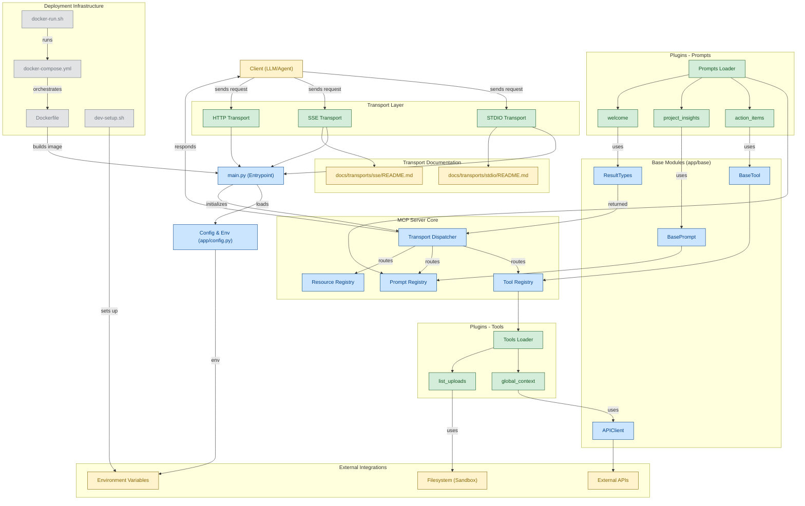

# MCP Base

A solid, foundational starting point for MCP projects. MCP Base is a production-ready, extensible template for building Model Context Protocol (MCP) servers in **Python**. Rapidly create, extend, and deploy MCP servers that expose tools, prompts, and resources to LLMs and agentic clients.

---

## 🚀 What is This?

This is a **Python starter base**—not a specific server implementation. It provides a modular, well-documented foundation for building your own MCP servers in Python, supporting multiple transport layers (STDIO, SSE, HTTP, etc.), and demonstrating best practices for security, extensibility, and maintainability.

---

## 🏗️ Architecture Overview

```
.
├── src/
│   ├── base/                # Base classes for tools, prompts, resources
│   ├── tools/               # Example tools (filesystem, API, prompt, etc.)
│   ├── resources/           # Example resources (static/dynamic)
│   ├── prompts/             # Example prompts (text generation, summarization)
│   ├── transports/          # Transport layer implementations & docs
│   │   ├── stdio/
│   │   │   └── README.md
│   │   ├── sse/
│   │   │   └── README.md
│   │   └── ...
│   ├── config.py            # Configuration and environment management
│   ├── server.py            # Server instantiation and registration
│   └── main.py              # Entrypoint: selects transport, starts server
├── tests/                   # Example tests for tools/resources
├── Dockerfile               # Containerized deployment
├── requirements.txt / pyproject.toml
├── README.md                # This file
├── CONTRIBUTING.md
└── ...
```

---

## Architecture Diagram



---

## ✨ Features

- **Multi-Transport Support:** STDIO, SSE, HTTP, and more (see `/src/transports/`)
- **Modular Tools/Prompts/Resources:** Add new features by creating a class and registering it
- **Type-Safe Input Validation:** Uses Pydantic for schemas
- **Security Best Practices:** Directory sandboxing, input validation, error handling
- **Extensible & Maintainable:** Clean separation of concerns, base classes, and registries
- **Production-Ready:** Logging, environment management, Docker support
- **Comprehensive Documentation:** For users and contributors

---

## 🛠️ Getting Started

### 1. Install Dependencies

```bash
pip install -r requirements.txt
```

### 2. Configure Environment

Copy `.env.example` to `.env` and fill in required values.

### 3. Run the Server

**STDIO Transport:**
```bash
python main.py --transport=stdio
```

**SSE/HTTP Transport:**
See `/src/transports/sse/README.md` and `/src/transports/http/README.md` for details.

---

## 🧩 Adding Tools, Prompts, and Resources

### Tools

- Create a new class in `/src/tools/` inheriting from `BaseTool`
- Implement the required methods and input schema
- Register the tool in the tool registry

### Prompts

- Create a new class in `/src/prompts/` inheriting from `BasePrompt`
- Implement the required methods and input schema
- Register the prompt in the prompt registry

### Resources

- Add static or dynamic resources in `/src/resources/`
- Register them in the resource registry

---

## 🔌 Supported Transports

- **STDIO:** For CLI and agentic integration (see `/src/transports/stdio/README.md`)
- **SSE:** For server-sent events and web clients (see `/src/transports/sse/README.md`)
- **HTTP:** For RESTful or web-based integration (see `/src/transports/http/README.md`)

Each transport is modular and can be extended or replaced.

---

## 🛡️ Security & Best Practices

- All file and directory operations are sandboxed to allowed paths
- Input validation is enforced for all tool/resource inputs
- Error handling is consistent and user-friendly
- Sensitive configuration is managed via environment variables

---

## 🧪 Testing

- Example tests are provided in `/tests/`
- Use Pytest as the test runner
- See CONTRIBUTING.md for test guidelines

---

## 🤝 Contributing

We welcome contributions! Please see [CONTRIBUTING.md](CONTRIBUTING.md) for guidelines, code style, and PR process.

---

## 📚 Further Reading

- [Model Context Protocol Documentation](https://modelcontextprotocol.io/introduction)
- [Official MCP Python SDK](https://github.com/modelcontextprotocol/python-sdk)
- [Reference MCP Servers Gallery](https://github.com/modelcontextprotocol/servers)
- [Transport Layer Docs](/src/transports/)

---

## 📝 License

MIT License. See [LICENSE](LICENSE) for details.

---

## 💬 Community & Support

- [Discord](https://discord.gg/jHEGxQu2a5)
- [Reddit](https://www.reddit.com/r/modelcontextprotocol)
- [GitHub Discussions](https://github.com/orgs/modelcontextprotocol/discussions)

---

MCP Base is the recommended starting point for all new Python MCP server projects. Fork, extend, and contribute improvements!
